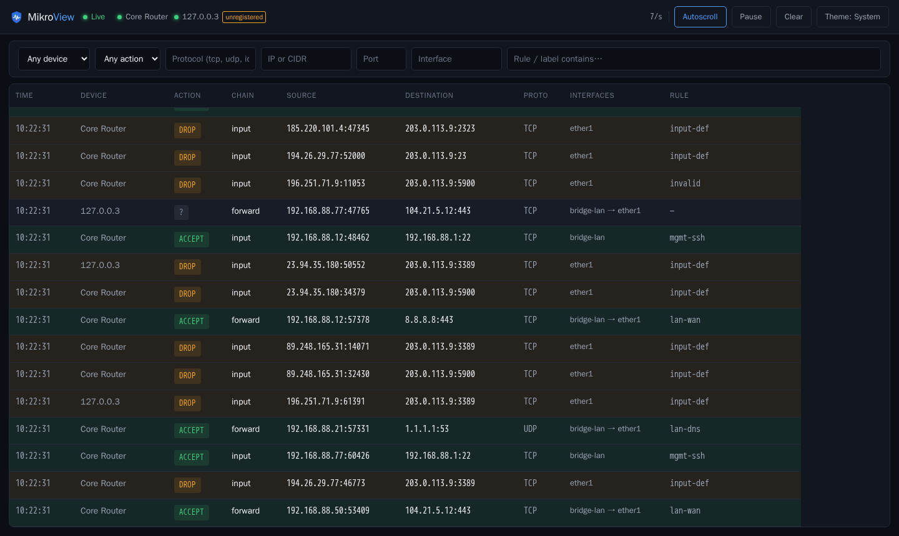

> [!IMPORTANT]
> **Development disclosure:** MikroView was coded by Claude under human
> direction.

<p align="center">
  <picture>
    <source media="(prefers-color-scheme: dark)" srcset="brand/logo-lockup-dark.svg">
    <source media="(prefers-color-scheme: light)" srcset="brand/logo-lockup-light.svg">
    
  </picture>
</p>

A real-time firewall "live view" for RouterOS, in the spirit of
OPNsense's live view: see every connection attempt as it happens,
whether it was accepted, dropped, or rejected, and by which rule —
filterable by device, IP/CIDR, port, protocol, interface, or rule.

Ships as a single Docker container. RouterOS pushes firewall log lines
to it over syslog (no API access, no credentials, near-zero load on the
router); MikroView parses, stores, and streams them to a fast, dark,
dependency-light web UI.

<p align="center">
  
</p>

## Quickstart

```sh
cp deploy/config.example.yaml deploy/config.yaml
# edit deploy/config.yaml with your router(s)' names/IPs, then:
chmod 644 deploy/config.yaml

cd deploy
docker compose up -d --build
```

Then follow [docs/routeros-setup.md](docs/routeros-setup.md) to point
your RouterOS device(s) at the container, and open
`https://<docker-host>:8080`. mikroview serves TLS by default with a
self-generated certificate (see [docs/configuration.md](docs/configuration.md#tls)),
so your browser will show an untrusted-certificate warning on first
visit until you import that certificate -- expected for a self-hosted
admin interface with no external CA, same as Proxmox/TrueNAS/pfSense's
own web UIs.

### Prebuilt image

```sh
docker pull ghcr.io/tomlawesome/mikroview:latest
```

Or run it directly with Compose, without cloning the repo:

```yaml
services:
  mikroview:
    image: ghcr.io/tomlawesome/mikroview:latest
    restart: unless-stopped
    ports:
      # Host 514 -> the conventional syslog port RouterOS targets; the
      # container listens on 1514 internally since it runs as a non-root
      # user that can't bind <1024 (see Dockerfile).
      - "514:1514/udp"
      - "514:1514/tcp"
      # HTTPS by default (TLS is on unless tls.enabled: false) --
      # https://localhost:8080 after starting, not http://. With no
      # tls.certFile/keyFile configured below, mikroview generates its
      # own local CA + certificate on first start and your browser will
      # show an untrusted-certificate warning until you import that CA
      # (fetch it from /ca.crt, or check the startup log for its
      # fingerprint) -- see docs/configuration.md's "TLS" section,
      # including the one supported reason to set tls.enabled: false.
      - "8080:8080"
    healthcheck:
      test: ["CMD", "/mikroview", "-healthcheck"]
      interval: 30s
      timeout: 5s
      start_period: 10s
      retries: 3
    volumes:
      - ./config.yaml:/etc/mikroview/config.yaml:ro
      # Optional -- see docs/configuration.md's GeoIP section. Requires
      # your own MaxMind GeoLite2 database; uncomment both this and the
      # env var below once you have one.
      # - ./GeoLite2-Country.mmdb:/etc/mikroview/GeoLite2-Country.mmdb:ro
      # Optional -- persists behavioral flags (port scans, activity
      # spikes, etc; see docs/configuration.md's "Behavioral flags"
      # section), per-detector on/off+scope toggles made via the live
      # admin UI (see "Per-detector toggles"), and/or local accounts
      # (see "Authentication") across restarts. Uncomment this and
      # whichever env var(s) below you need -- all three files live in
      # the same directory. Flags and detector settings are fully
      # optional (left unconfigured, they still work, just reset on
      # restart); accounts are not the same way -- if you create one,
      # this volume and MIKROVIEW_AUTH_STORE_PATH must both be set
      # first, or account creation is refused rather than creating one
      # that would vanish on restart. The container runs as uid 65532
      # (distroless nonroot), which won't own a freshly created host
      # directory -- `mkdir -p flags-data && chmod 777 flags-data` is
      # the simplest fix if you hit a permission error at startup.
      # - ./flags-data:/var/lib/mikroview
      # Optional -- persists mikroview's self-generated local CA +
      # certificate (see docs/configuration.md's "TLS" section) across
      # restarts, so the browser/reverse-proxy trust step only happens
      # once instead of every restart. Not needed at all if you're
      # supplying your own cert via MIKROVIEW_TLS_CERT_FILE/KEY_FILE, or
      # don't mind re-trusting a fresh CA each restart.
      # - ./tls-data:/var/lib/mikroview/tls
    environment:
      - MIKROVIEW_CONFIG=/etc/mikroview/config.yaml
      # - MIKROVIEW_GEOIP_DB_PATH=/etc/mikroview/GeoLite2-Country.mmdb
      # - MIKROVIEW_FLAGS_STORE_PATH=/var/lib/mikroview/flags.json
      # - MIKROVIEW_FLAGS_DETECTOR_SETTINGS_STORE_PATH=/var/lib/mikroview/detector-settings.json
      # - MIKROVIEW_AUTH_STORE_PATH=/var/lib/mikroview/users.json
      # TLS is on by default and needs no configuration to work -- these
      # are only for customizing it.
      # - MIKROVIEW_TLS_STORE_PATH=/var/lib/mikroview/tls
      # - MIKROVIEW_TLS_HOSTS=192.168.1.50,mikroview.local
      # - MIKROVIEW_TLS_CERT_FILE=/etc/mikroview/tls.crt
      # - MIKROVIEW_TLS_KEY_FILE=/etc/mikroview/tls.key
      # Only set this if mikroview's port above is NOT published/
      # reachable from anywhere except your own reverse proxy over an
      # isolated docker network -- never on a deployment where this
      # port reaches a LAN or the internet directly. See
      # docs/configuration.md's "TLS" section before using this.
      # - MIKROVIEW_TLS_ENABLED=false
```

Create `config.yaml` next to it first (see [`deploy/config.example.yaml`](deploy/config.example.yaml) for the full option reference), then `docker compose up -d`. This mirrors [`deploy/docker-compose.yml`](deploy/docker-compose.yml) exactly, just swapping the local `build:` for the prebuilt `image:`.

## How it works

- **Ingestion**: RouterOS forwards firewall log lines via
  `/system logging` over syslog (UDP or TCP). No polling, no RouterOS
  API access, no credentials — push-based and cheap for the router.
- **Parsing**: a RouterOS-specific parser decodes chain, action, rule
  label, interfaces, protocol, addresses/ports, and length from each
  log line. See [docs/routeros-setup.md](docs/routeros-setup.md) for the
  log-prefix convention that makes "accept vs. drop vs. reject" and the
  responsible rule visible at all.
- **Storage**: in-memory only, a fixed-capacity ring buffer windowed to
  a configurable retention period (default 24h) — no database, and no
  disk persistence. All retained events are lost on restart, redeploy,
  or crash; MikroView is a live/recent-history view, not a log archive.
  The one deliberate exception is behavioral flags (see below), which
  can optionally persist to a small JSON file since they're meant to
  stay visible until a human clears them.
- **Behavioral flags**: watches for port scans, per-source activity
  spikes, repeated attempts against critical ports (SSH, RDP, Winbox,
  ...) from external IPs, and network-wide volume spikes — each raises a
  flag for a human to review and clear, never an automatic action. See
  [docs/configuration.md](docs/configuration.md) for the detectors and
  their thresholds.
- **Live updates**: a WebSocket pushes new events to the browser in
  real time; historical/filtered queries go through a REST endpoint
  against the retained buffer. See
  [docs/configuration.md](docs/configuration.md) for the API and the
  server/client filtering split.
- **UI**: Svelte, no component framework, dark professional theme,
  ~50KB JS bundle.
- **Authentication**: fully open until you create the first local
  account, at which point it becomes required for everything except the
  health check — Argon2id-hashed passwords, opaque server-side sessions,
  self-registration for the first (super-admin) account only. See
  [docs/configuration.md](docs/configuration.md) and
  [SECURITY.md](SECURITY.md) for the threat model and setup.
- **Deployment**: multi-stage Docker build, final image based on
  distroless `nonroot`, embeds the built frontend into the Go binary via
  `go:embed` — one process, one image.

## Development

Requires Go 1.26+ and Node 22+.

```sh
make dev-backend    # go run ., syslog on :1514, https on :8080 (TLS on by default -- see docs/configuration.md#tls)
make dev-frontend   # vite dev server on :5173, proxies /api to :8080 over TLS
make test           # go test ./... + svelte-check
make build           # full build: frontend -> web/dist -> single Go binary
make docker          # docker build -t mikroview .
```

Feed it fixture syslog lines without a real router, e.g.:

```sh
printf '<134>Jan 15 10:22:31 MikroTik A|lan-wan|forward: in:ether1 out:bridge1, connection-state:new, proto TCP (SYN), 192.168.1.50:51234->1.2.3.4:443, len 60' \
  | nc -u -w1 127.0.0.1 1514
```

## Docs

- [docs/routeros-setup.md](docs/routeros-setup.md) — RouterOS-side
  configuration (syslog forwarding, log-prefix convention)
- [docs/configuration.md](docs/configuration.md) — config.yaml
  reference, env vars, API reference
- [brand/BRANDING.md](brand/BRANDING.md) — logo files, color tokens,
  how to regenerate the PNG exports

## Not (yet) included

Deliberately deferred rather than half-built: SSO/OIDC (local accounts
only for now), TLS syslog, multi-arch images, config hot-reload,
server-side WebSocket filtering, JSON export.
