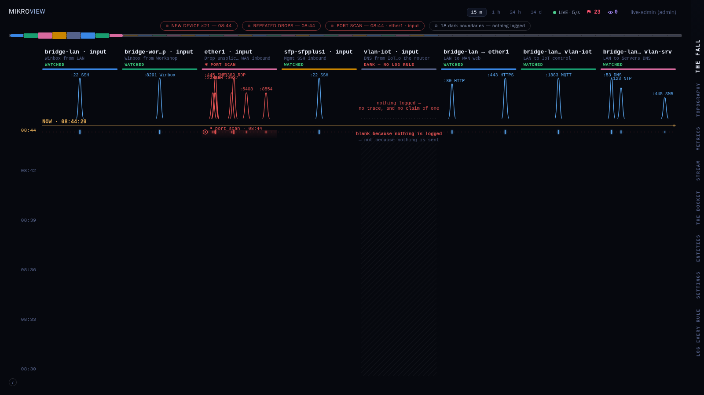

> [!IMPORTANT]
> **Development disclosure:** MikroView was coded by Claude under human
> direction.

> [!WARNING]
> **Under heavy development:** MikroView is pre-1.0 and still changing
> shape. Not every feature described below is finished, and some do not
> yet work as intended.

<p align="center">
  <picture>
    <source media="(prefers-color-scheme: dark)" srcset="brand/logo-lockup-dark.svg">
    <source media="(prefers-color-scheme: light)" srcset="brand/logo-lockup-light.svg">
    
  </picture>
</p>

A real-time firewall "live view" for RouterOS: see every connection
attempt as it happens, whether it was accepted, dropped, or rejected,
and by which rule — filterable by device, IP/CIDR, port, protocol,
interface, or rule.

Ships as a single Docker container. RouterOS pushes firewall log lines
to it over syslog (MikroView never connects to the router, uses its API
or holds its credentials; near-zero load on the router); MikroView
parses, stores, and streams them to a fast, dark, dependency-light web
UI.

<p align="center">
  
</p>

## Quickstart

```sh
cp deploy/config.example.yaml deploy/config.yaml
# edit deploy/config.yaml with your router(s)' names/IPs, then:
chmod 644 deploy/config.yaml

cd deploy
docker compose up -d --build
```

Then follow [docs/routeros-setup.md](docs/routeros-setup.md) to point
your RouterOS device(s) at the container, and open
`https://<docker-host>` (port 443). A plain `http://<docker-host>`
request on port 80 redirects there automatically. MikroView serves TLS
by default with a
self-generated certificate (see [docs/configuration.md](docs/configuration.md#tls)),
so your browser will show an untrusted-certificate warning on first
visit until you import that certificate -- expected for a self-hosted
admin interface with no external CA, same as Proxmox/TrueNAS/pfSense's
own web UIs.

See [docs/reading-the-fall.md](docs/reading-the-fall.md) for how to
read the fall, the app's landing view.

### Prebuilt image

```sh
docker pull ghcr.io/tomlawesome/mikroview:latest
```

Or run it directly with Compose, without cloning the repo:

```yaml
services:
  mikroview:
    image: ghcr.io/tomlawesome/mikroview:latest
    restart: unless-stopped
    ports:
      # RouterOS remote-protocol=tls (RFC 5425's syslog-over-TLS port,
      # already unprivileged so no remap is needed). MikroView's only
      # syslog listener -- comment this out (and set
      # MIKROVIEW_LISTEN_SYSLOG_TLS= below) only if you want no syslog
      # ingest at all.
      - "6514:6514/tcp"
      # HTTPS by default, on the conventional port -- see the Quickstart
      # above and docs/configuration.md's "TLS" section.
      - "443:8080"
      # A plain-HTTP listener that only ever redirects to the HTTPS
      # port above -- never serves real content.
      - "80:8081"
    # Container hardening -- defense in depth on top of the image
    # already being distroless + non-root. MikroView binds only
    # unprivileged ports inside the container (which is why the
    # mappings above exist), so it needs no capabilities at all, and
    # every path it writes to is a mount -- see "Persistent data".
    security_opt:
      - no-new-privileges:true
    cap_drop:
      - ALL
    read_only: true
    healthcheck:
      test: ["CMD", "/mikroview", "-healthcheck"]
      interval: 30s
      timeout: 5s
      start_period: 10s
      retries: 3
    volumes:
      - ./config.yaml:/etc/mikroview/config.yaml:ro
      # Optional -- see docs/configuration.md's GeoIP section. Requires
      # your own MaxMind GeoLite2 database; uncomment both this and the
      # env var below once you have one.
      # - ./GeoLite2-Country.mmdb:/etc/mikroview/GeoLite2-Country.mmdb:ro
      # Persists flags/accounts/detector settings/the new-device MAC
      # registry/the TLS cert across container recreation, not just
      # restarts -- see "Persistent data" below for what this is and
      # the bind-mount alternative.
      - mikroview-data:/var/lib/mikroview
      # Alternative to the named volume above: a bind mount, if you want
      # to browse/back up the files directly from the host. Comment out
      # the line above and uncomment this one instead (not both) -- see
      # "Persistent data" below for the permissions step this needs
      # first.
      # - ./data:/var/lib/mikroview
    environment:
      - MIKROVIEW_CONFIG=/etc/mikroview/config.yaml
      # - MIKROVIEW_GEOIP_DB_PATH=/etc/mikroview/GeoLite2-Country.mmdb
      # Only needed to move a store somewhere other than the default
      # /var/lib/mikroview/*.json -- see docs/configuration.md.
      # - MIKROVIEW_FLAGS_STORE_PATH=/var/lib/mikroview/flags.json
      # - MIKROVIEW_AUTH_STORE_PATH=/var/lib/mikroview/users.json
      # - MIKROVIEW_DEVICE_MAC_STORE_PATH=/var/lib/mikroview/mac-registry.json
      # TLS is on by default and needs no configuration to work -- these
      # are only for customizing it.
      # - MIKROVIEW_TLS_STORE_PATH=/var/lib/mikroview/tls
      # - MIKROVIEW_TLS_HOSTS=192.168.1.50,mikroview.local
      # - MIKROVIEW_TLS_CERT_FILE=/etc/mikroview/tls.crt
      # - MIKROVIEW_TLS_KEY_FILE=/etc/mikroview/tls.key
      # Read docs/configuration.md's "TLS" section before using this --
      # only safe if this port is unreachable except from your own
      # isolated-network reverse proxy.
      # - MIKROVIEW_TLS_ENABLED=false
      # Disables the plain-HTTP redirect-only listener above -- only
      # needed if you've removed the "80:8081" port mapping too (e.g.
      # your reverse proxy handles the HTTP->HTTPS redirect itself).
      # - MIKROVIEW_LISTEN_HTTP_REDIRECT=
      # Disables syslog ingest entirely -- MikroView's only syslog
      # listener is RouterOS remote-protocol=tls, so only set this if
      # you don't want firewall events at all. Remove the "6514:6514/tcp"
      # port mapping above too if you do.
      # - MIKROVIEW_LISTEN_SYSLOG_TLS=

volumes:
  mikroview-data:
```

**Image tags**: `latest` is the tag intended for general use -- the most recent release, promoted from `preview` after passing CI and a container smoke test. Every release is also published under its own immutable tag (`ghcr.io/tomlawesome/mikroview:v0.5.1`, matching the `v*` git tag and the [CHANGELOG](CHANGELOG.md)), if you would rather pin one. `preview-<7-char-sha>` tags exist for every build off the `preview` branch, if you ever want to pin to a specific one rather than track `latest`. There is deliberately no `dev` tag: pushing to the `dev` branch never triggers a build at all, so nothing publishes from it -- if you ever see one referenced anywhere (including in your own `docker images` history), treat it as stale rather than a live channel, since nothing keeps it current.

Create `config.yaml` next to it first (see [`deploy/config.example.yaml`](deploy/config.example.yaml) for the full option reference), then `docker compose up -d`. This mirrors [`deploy/docker-compose.yml`](deploy/docker-compose.yml) exactly, just swapping the local `build:` for the prebuilt `image:`.

### Persistent data

By default, both compose files above mount a **named volume** over
`/var/lib/mikroview` -- where flags, local accounts, detector on/off
toggles, the new-device detector's MAC registry, and the self-generated
TLS certificate all persist. This is the default deliberately: once
you've set up authentication or have flags worth keeping, losing them
on every `docker compose down` or image update -- not just a plain
restart -- would be a bad surprise, not an edge case. Docker populates
a fresh named volume from the image's own `/var/lib/mikroview` on first
use, ownership included, so there's no setup step needed.

The tradeoff is that you can't `cat`/`cp`/back up the files directly
from the host the way you can with a bind mount -- you'd go through
`docker run --rm -v mikroview-data:/data ...` or `docker cp` instead.
If you want that direct host access, switch to the commented-out bind
mount in either compose file (`./data:/var/lib/mikroview`) instead of
the named volume -- but it needs one extra step first: MikroView runs
as a fixed non-root user inside the container, **uid `65532`, gid
`65532`** (distroless's built-in `nonroot` account, same identity used
by the `--chown` in the Dockerfile), which can't chown a host directory
the way a root-run container could. Pick one before starting:

```sh
# Preferred: exact uid/gid ownership, nothing broader
mkdir -p data
sudo chown 65532:65532 data
```

```sh
# No root available on the host: open it up to everyone instead
mkdir -p data
chmod 777 data
```

The same fix applies to any other host path you bind-mount over a
`/var/lib/mikroview/*` sub-path (e.g. `flags.storePath`, `auth.storePath`,
`tls.storePath` — see [docs/configuration.md](docs/configuration.md)), or
over `/etc/mikroview/GeoLite2-Country.mmdb` if you ever mount that
read-write. Read-only mounts like `config.yaml` don't need either fix —
world-readable (`chmod 644`, as in the Quickstart above) is enough, since
the container only needs to read it, not own it.

If a bind mount is misconfigured (wrong ownership), MikroView logs
`permission denied` at startup and falls back to in-memory-only state
rather than crashing — annoying (you lose flags/accounts/TLS cert on
every restart) but not fatal.

## Features

- **Ingestion**: RouterOS forwards firewall log lines via
  `/system logging` over syslog-over-TLS (`remote-protocol=tls`). No
  polling, no RouterOS API access, no RouterOS credentials held by
  MikroView — push-based and cheap for the router. The optional config
  and backup pushes carry an ingest token MikroView mints per device.
- **Parsing**: a RouterOS-specific parser decodes chain, action, rule
  label, interfaces, protocol, addresses/ports, and length from each
  log line. See [docs/routeros-setup.md](docs/routeros-setup.md) for the
  log-prefix convention that makes "accept vs. drop vs. reject" and the
  responsible rule visible at all.
- **Storage**: by default, events live in a fixed block of memory — a
  ring buffer that overwrites the oldest event once full, windowed to
  `store.retention` (default 24h) and gone on restart. An optional
  on-disk history (`history:` in config.yaml, off by default) writes
  the same events to one encrypted, compressed file per day and keeps
  `history.days` of them, so flag thresholds can be judged against
  weeks of real traffic rather than just what the ring still holds.
  See
  [docs/configuration.md](docs/configuration.md#on-disk-event-history-optional-off-by-default).
  Behavioral flags (see below) can still persist to a small JSON file
  as before, since they're meant to stay visible until a human clears
  them.
- **Router backups**: an optional SFTP drop box (`backup:` in
  config.yaml, off by default) where the router's own nightly script
  pushes its binary `.backup` and plain-text `.rsc` export, so the
  copies are still to hand when the router itself is gone. See
  [docs/configuration.md](docs/configuration.md#router-backups-over-sftp-optional-off-by-default).
- **Behavioral flags**: watches for port scans, per-source activity
  spikes, repeated attempts against critical ports (SSH, RDP, Winbox,
  ...) from external IPs, and network-wide volume spikes — each raises a
  flag for a human to review and clear, never an automatic action. See
  [docs/configuration.md](docs/configuration.md) for the detectors and
  their thresholds.
- **Watchlist**: operator-defined entries, persisted and queryable, in
  two modes — **record** ("watch attempts against these ports") and
  **invert** ("this device should only ever reach these destinations",
  reviewed via an observe-then-promote workflow before anything is
  treated as a violation). Tuning entries against your own network's
  traffic is expected and ongoing, not a one-time setup step: MikroView
  presents what it saw and lets you decide what's expected, it never
  decides that for you. And like everything else here, it only ever
  sees what the router is actually configured to log — an entry with no
  matches can mean "nothing happened" or "nothing logs this," and
  telling those apart is on the operator, not the tool. See
  [docs/configuration.md](docs/configuration.md)'s "Watchlist" section.
  Entries can also be **suggested** from data your router has already
  pushed (named DHCP leases, ports an existing rule already blocks), so
  there's something to react to rather than a blank page — reviewed
  Off/Accepted/Hidden, never applied automatically. See that section's
  "Suggested watchlist entries" subsection.
- **Live updates**: a WebSocket pushes new events to the browser in
  real time; historical/filtered queries go through a REST endpoint
  against the retained buffer. See
  [docs/configuration.md](docs/configuration.md) for the API and the
  server/client filtering split.
- **UI**: Svelte, no component framework, dark professional theme,
  ~201KB of JavaScript over the wire (~667KB before compression). CI
  gates the bundle at 230KB gzipped — the measured reading plus ~15%,
  re-derived after the v0.4.0 interface reshape shipped (see
  [docs/decisions/ui-framework.md](docs/decisions/ui-framework.md)).
- **Logging**: leveled (debug/info/warn/error) and colorized server
  output, auto-plain when piped or `NO_COLOR` is set. See
  [docs/configuration.md](docs/configuration.md)'s "Logging" section.
- **Authentication**: required, always. On first load MikroView asks you
  to create the admin account, and serves nothing else until you do.
  After that it is required for everything except the health check
  (Argon2id-hashed passwords, opaque server-side sessions,
  self-registration for the first/super-admin account only). Local
  accounts and single sign-on via an external OIDC identity provider
  (e.g. Authentik, Keycloak, Entra ID) can both be enabled at once. See
  [docs/configuration.md](docs/configuration.md) and
  [SECURITY.md](SECURITY.md) for the threat model and setup.

## Security levels

Auth isn't one setting — the choice you make trades off convenience
against how much a compromise of the MikroView host itself can expose.
From least to most isolated:

1. **Local accounts (username/password).** The floor — MikroView will
   not serve anything until one exists. Simplest to set up, but account data — usernames and
   roles, including who's the admin — lives in a plaintext file on the
   same host MikroView runs on. There's no separation between "the app
   is compromised" and "the account data is readable": a leaked
   backup, a misconfigured mount, or anything that exposes that one
   file hands over who to target, and local login security then
   depends entirely on password strength.
2. **OIDC/SSO (recommended when available).** The real credential
   lives with your external identity provider (Authentik, Keycloak,
   Entra ID, ...), never on the MikroView host — compromising the host
   doesn't expose anything usable against an SSO-provisioned account.
   Local and SSO accounts can coexist.
3. **Off-box database backend (Postgres, optional).** Moving persisted
   state to a separately-secured, network-restricted database closes
   the "read one file, get everything" exposure that local accounts
   still have today. See
   [docs/configuration.md](docs/configuration.md#postgres-optional) for
   setup — added in issue #131.

Pick the level that matches your network: local accounts are the floor,
and SSO is worth preferring wherever you have an identity provider
available. Full detail and the reasoning behind each is in
[SECURITY.md](SECURITY.md#authentication).

## Docs

- [docs/routeros-setup.md](docs/routeros-setup.md) — RouterOS-side
  configuration (syslog forwarding, log-prefix convention)
- [docs/configuration.md](docs/configuration.md) — config.yaml
  reference, env vars, API reference
- [docs/reading-the-fall.md](docs/reading-the-fall.md) — how to read
  the fall, the app's landing view
- [docs/security-by-design.md](docs/security-by-design.md) — the
  security properties the design commits to
- [SECURITY.md](SECURITY.md) — threat model, hardening and how to
  report a vulnerability
- [brand/BRANDING.md](brand/BRANDING.md) — logo files, color tokens,
  how to regenerate the PNG exports
- [CONTRIBUTING.md](CONTRIBUTING.md) — branching model and local
  development setup, for anyone submitting a pull request

## License

MikroView is free and open source under the
[GNU AGPL v3.0](LICENSE). You can use, modify and self-host it at no
cost, including inside a business.

If you want to bundle MikroView into a commercial product, offer it as
a hosted service, or ship changes without publishing them, a commercial
licence is available — see
[COMMERCIAL-LICENSE.md](COMMERCIAL-LICENSE.md).
