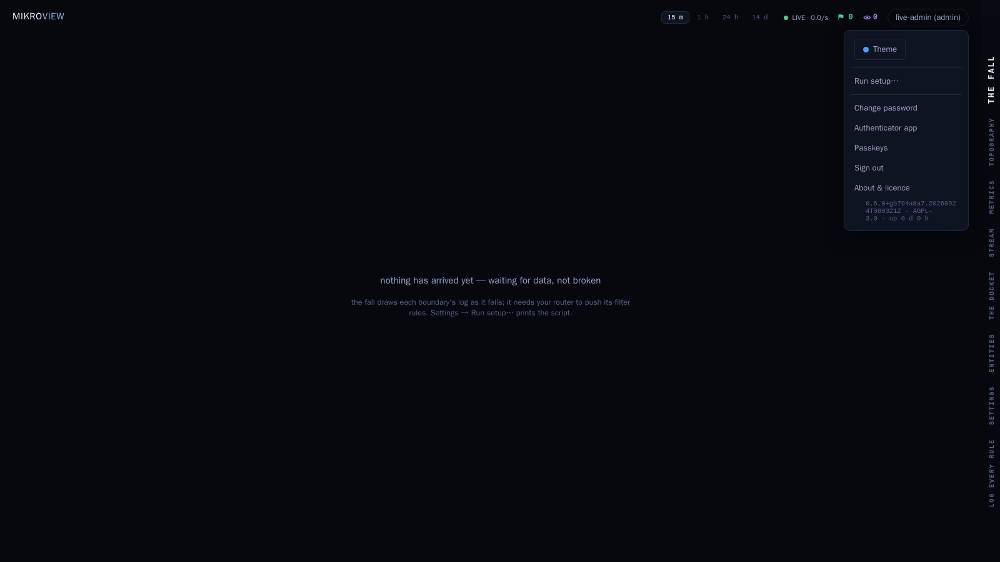
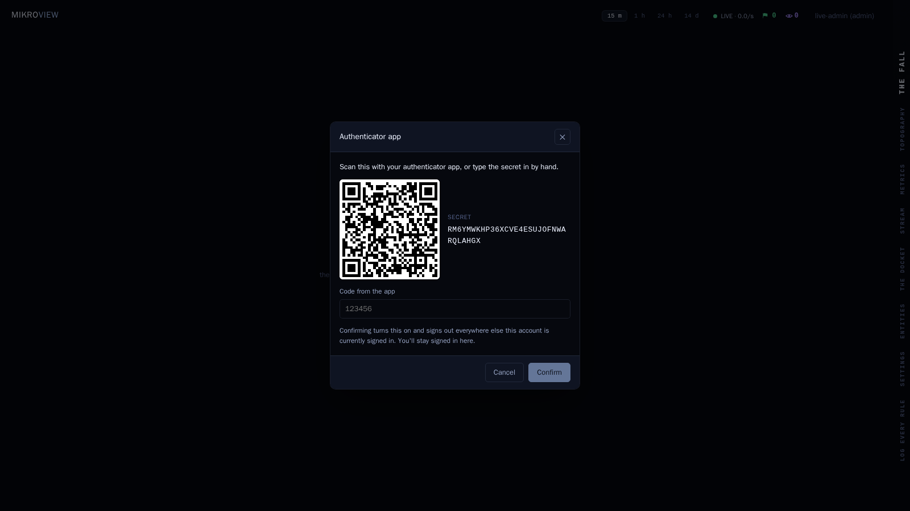
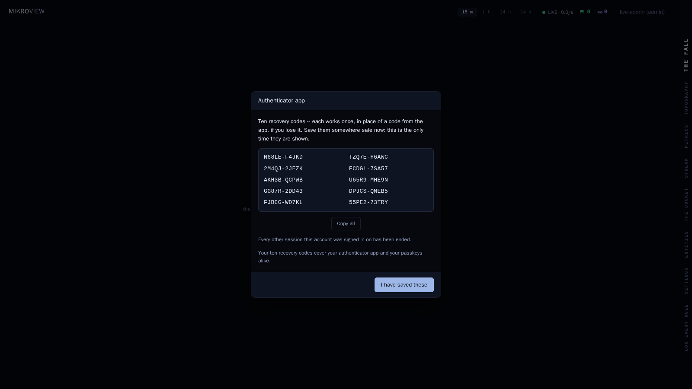

# Setting up a second factor: authenticator app and passkeys

A second step at sign-in, on top of your password — and, for every
local account, required, not optional: MikroView won't let a signed-in
session go anywhere else until one is active (see
[docs/configuration.md](configuration.md#sso-is-additive-keep-a-local-admin)
for how this fits with single sign-on). MikroView offers two independent
kinds:

- **An authenticator app** — a 6-digit code from an app on your phone
  (Google Authenticator, 1Password, Bitwarden, or similar).
- **A passkey** — your device's own fingerprint, face or screen-lock
  PIN, or a physical security key. No code to type or app to open.

Set up either one, or both — the account menu lists them as two
separate rows, and each works on its own. Someone who only has your
password can't sign in without one of them too. If you're not sure
which to pick: a passkey is quicker day to day and nothing to type, but
it needs MikroView to have a proper web address configured first (see
"Passkeys need a web address" below); the authenticator app works
anywhere, including a bare IP address, at the cost of typing a code
each time.

**Recovery codes are shared between the two.** Whichever one you set
up first mints one set of ten codes, and that same set backs both —
see "Save your recovery codes" below.

**Single sign-on accounts don't need either.** If you sign in through
SSO, your identity provider is what verifies you, and the account menu
says so instead of asking you to set one up — a MikroView-side second
step would be securing a login your identity provider already owns.

## Authenticator app

### Turning it on

Open the account menu (click your username, bottom of the rail) and
choose **Authenticator app**.



Press **Set up authenticator app**. MikroView shows a QR code and, next
to it, the same secret written out as text.



Scan the QR code with your app, or, if scanning doesn't work, type the
secret in by hand — it's shown for exactly that reason, not only as a
fallback. Either way your app starts showing a fresh 6-digit code every
30 seconds.

### Confirming it

Type the current code from your app into the box and press **Confirm**.
This is what actually turns the factor on — until you confirm, nothing
you scanned or typed has changed how you sign in.

Confirming always signs out every other browser or device this account
is currently signed into, whether or not you already have a passkey
set up. You stay signed in here. If that's unexpected — somewhere else
you didn't recognise was signed in — that's worth noticing.

### Turning it off

Open the account menu, choose **Authenticator app**, then **Turn
off** — this asks for your password first. If you still have a passkey
set up, that's it: you're back to signing in with whichever one is
left.

**If the authenticator app was your only second factor, turning it off
signs you out at once, and MikroView asks you to set one up again —
app or passkey, your choice — the next time you sign in.** A local
account is never left without a second factor for more than that one
moment.

## Passkeys

### Passkeys need a web address

A passkey is tied to the web address you reach MikroView on — that's
how the underlying technology (WebAuthn) works, so it can never be
bound to a bare IP address. Before anyone can add one, an admin has to
set `publicUrl` in the server config to the https address the
deployment is actually reached on. See [Public URL in
docs/configuration.md](configuration.md#public-url-publicurl-optional-for-passkeys)
for how to set it.

Until that's done, the **Passkeys** row in the account menu is still
there — it's never hidden — but opening it explains why passkeys
aren't available yet rather than offering to add one. The authenticator
app has no such requirement and works from any address, IP included.

**If `publicUrl` changes later**, any passkey registered under the old
address stops working — see "If your web address changes" below.

### Turning one on

Open the account menu and choose **Passkeys**, then press **Add
passkey**. Give it a name — something that will remind you which
device it's on, like "this laptop" or "YubiKey" — and continue. Your
browser then prompts you the normal way it does for a fingerprint, face
scan, screen-lock PIN or security key tap.

Adding your very first second factor of either kind — the first
passkey, if you haven't already set up an authenticator app — signs out
every other browser or device this account is currently signed into,
the same as confirming an authenticator app does. Adding a second (or
third) passkey afterwards doesn't sign anything out.

You can register up to ten passkeys on one account — a phone, a laptop
and a couple of security keys, say — and each one shows in the list
with when it was added and when it was last used.

### Adding, renaming and removing passkeys

From the **Passkeys** row, you can add more, rename any of them (no
password needed — it's cosmetic), or remove one (this asks for your
password first, the same guard as turning off the authenticator app).
Removing a passkey doesn't touch your recovery codes unless it was your
very last second factor of either kind — see "Save your recovery
codes" below. Removing your very last one has the same effect turning
off your only authenticator app does (see "Turning it off" above):
you're signed out at once and asked to set one up again the next time
you sign in.

### If your web address changes

Each passkey remembers the address it was created for. If `publicUrl`
later changes to a different address, a passkey made for the old one
becomes unusable there — the passkey list marks it "made for
`<old address>` — won't work here". It's still shown and still
removable, just not usable to sign in any more. Add a fresh passkey
once you're on the new address; your authenticator app, if you have
one, is unaffected either way.

If an account's *only* second factor is a passkey made for a different
address, the sign-in screen falls back to asking for a recovery code
instead, with an explanation — your password alone still never signs
you in.

## Save your recovery codes

The first time you activate a second factor — whichever kind you set
up first — MikroView shows ten recovery codes.



**This is the only time they're shown.** Each works once, in place of a
code from your app or a passkey prompt, if you can't get to either —
phone lost, out of battery, or just not to hand. Save all ten somewhere
safe now — a password manager is the obvious place — before you press
**I have saved these**. MikroView can't show them to you again.

The screen won't close by clicking outside it or pressing Escape,
unlike every other dialog in MikroView — the ten codes exist in the
clear nowhere else, so leaving has to be the deliberate "I have saved
these", not an accidental dismiss.

**Setting up the other kind afterwards doesn't mint a new set.** If you
already have an authenticator app and add a passkey (or the other way
round), MikroView tells you your existing codes still cover the new
factor too, rather than showing you a second set. Removing one factor
doesn't clear the codes either, as long as the other kind is still
active — codes are only cleared when your account goes back to having
no second factor at all (see "If you lose access" below). The only way
to draw a genuinely fresh set of ten is to remove every second factor
you have — which does clear the shared codes — and set one up again
from scratch.

## Signing in afterwards

Sign in with your username and password as usual. Once your password
checks out, MikroView asks for a second step instead of taking you
straight in.


What you see depends on what you've set up:

- **A passkey usable at this address** shows a **Use your passkey**
  button. It only fires on a click, never automatically — press it and
  your browser prompts you the same way it did when you added the
  passkey.
- **An authenticator app** shows the code box, exactly as before. Type
  the current code from your app and continue.
- If you have both, whichever one is offered first also carries a link
  to switch to the other, plus a link to use a recovery code instead —
  switching is instant and doesn't re-ask for your password.
- If your only passkeys were made for a different address than the one
  you're viewing MikroView from, that's said plainly, with a link to
  the address where they do work; you can still use a recovery code
  from here.

Get a code wrong (or let it expire), fail a passkey prompt, or wait too
long, too many times, and you're rate-limited the same way a wrong
password is — there's no separate, more generous allowance for guessing
the second step.

## Using a recovery code

If neither your phone nor your passkey is available, press **Use a
recovery code instead** on the second-step screen and type one of the
ten you saved instead of a code or a passkey prompt. It works exactly
once: MikroView marks it spent the moment it's accepted, so save the
ones you have left. Once you're back on your usual device, consider
drawing a fresh set — see "Save your recovery codes" above for how.

## If you lose access to your second factor

**You still have a password and at least one recovery code.** Sign in
with a recovery code as above, then open the account menu and turn off
or remove whichever factor you've lost — **Authenticator app** →
**Turn off**, or **Passkeys** → **Remove** on the affected one (both
need your password, the same guard as changing it). Set it up again
whenever you're ready.

**You have a password but no recovery codes left.** Ask your admin to
clear the factor from your account: Settings → **people** → your row →
**clear authenticator app** or **clear passkeys**, whichever you've
lost. This needs your admin to be signed in and does not need your
password — they're standing in for a credential you no longer have a
way to prove, the same reasoning behind an admin resetting someone's
password. Once it's cleared, sign in with your password alone and set
a factor up again if you want one.

**You're the admin, and it's your own factor that's stuck.** The
Settings buttons above deliberately refuse to clear the admin's own
factors — an admin who could clear their own second step from a
signed-in session could just as easily clear anyone's. Instead, from
the machine or container MikroView runs on:

```sh
mikroview -clear-second-factor <your-username>
```

This clears both kinds at once — your authenticator app and every
passkey, along with the shared recovery codes — whichever of them you
actually had set up. It's the same shape as
`mikroview -recover-admin-account`: it needs host access and one of
your recovery keys, and using it rotates your recovery keys, so save
the new set it prints before confirming. See
[docs/configuration.md](configuration.md#recovery-keys) if you're not
sure what a recovery key is or how to generate one.

**You've also forgotten your password.** That's a different problem —
see [docs/configuration.md](configuration.md#resetting-someones-password)
(an admin can help) or
[docs/configuration.md](configuration.md#recovering-the-admin-account)
if it's the admin account itself.
