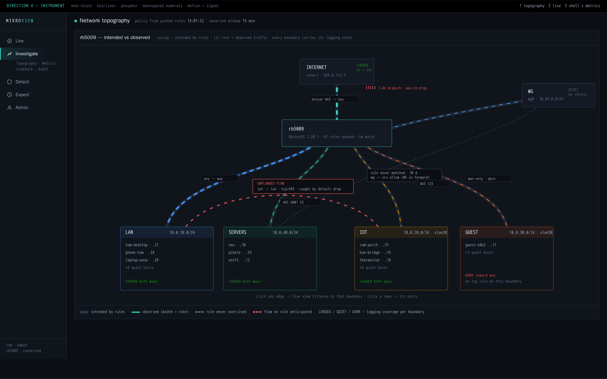
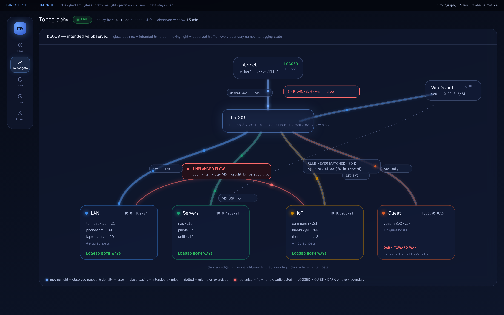
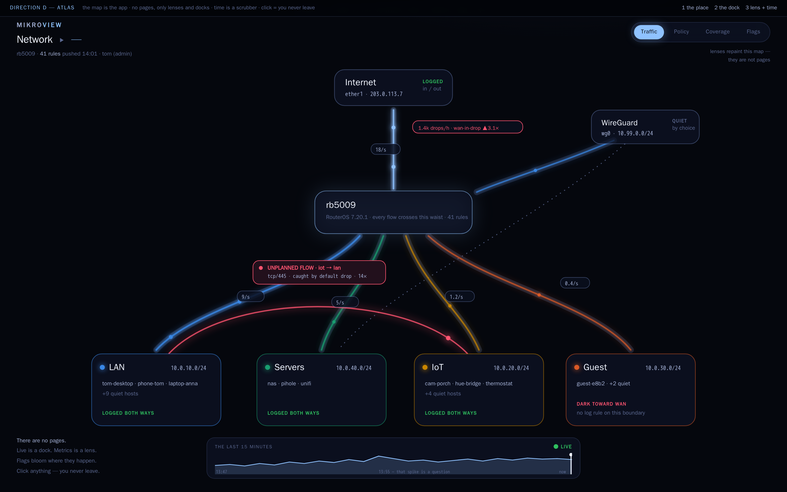
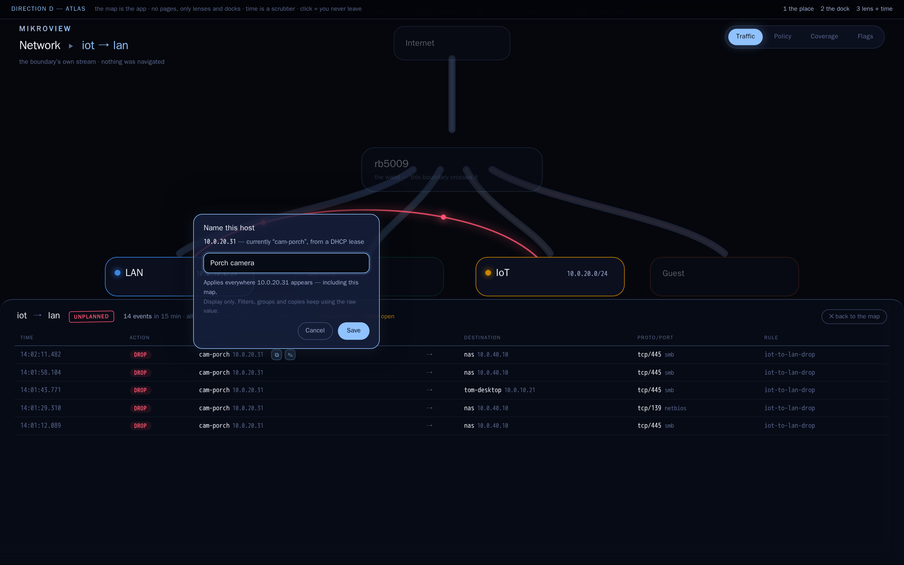
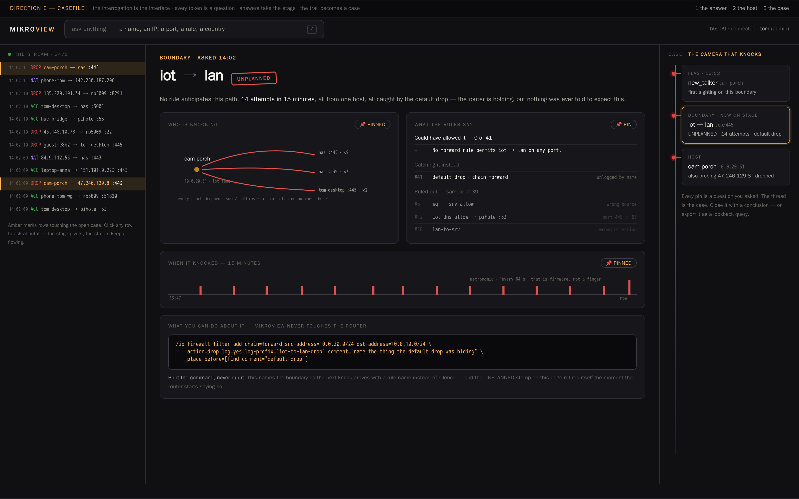
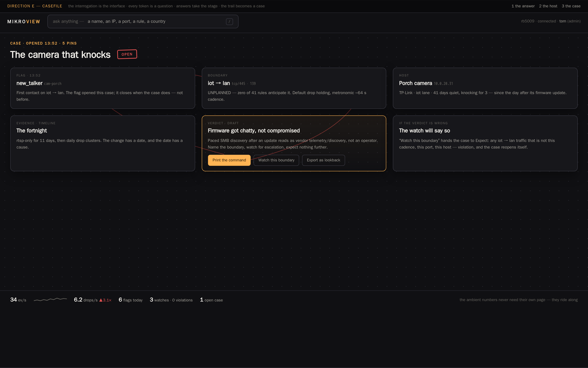

# Interface visioning — round 1

Part of #482 (framework choice) and #483 (interface shaping), under #385
phase 2. Owner direction, 2026-08-22: **vision first** — mock up the new
UI's boldest scenes as real visual concepts; the framework/design-system
ADR is written from what the chosen vision demands, not before it.

Each direction is one self-contained HTML file — open it in a browser
(no build step; the motion is real). Each renders the same three
identity scenes with the same data, so the comparison is honest:

1. **The living topography** — policy vs reality drawn: intended edges,
   observed traffic in motion, deltas (an unplanned IoT→LAN flow, a
   never-matched rule, a WAN drop concentration) and logging coverage
   (LOGGED / QUIET / DARK) on every boundary.
2. **The live view** — the daily driver, with the #413 rename editor
   open and the hold-while-open rule visible.
3. **The shell + metrics** — where the numbers live in that direction's
   model.

Screenshots are in `shots/` (regenerate with
`cd frontend && node ../docs/design/concepts/round-1/capture.mjs`).

## The directions

### A — Instrument (`direction-a-instrument.html`)

The flight-deck reading. Near-black, hairline rules, phosphor accent,
monospaced numerals, five-section left rail. Motion is signal: things
move only because packets moved. The conservative pole of the round —
the current app's soul, sharpened.

### C — Luminous (`direction-c-luminous.html`)

The network as a living thing drawn in light. Dusk gradient, glass
panels, traffic as particle streams riding the edges, alerts as pulses.
Same five-section model as A (floating icon rail), different soul:
warmth and depth instead of instrumentation.

### D — Atlas (`direction-d-atlas.html`)

**The map is the app.** There are no pages: the network is the one
place you stand. Live is a dock that rises when you click an edge;
metrics and coverage are lenses that repaint the map; flags bloom where
they happen; time is a scrubber that replays the last fifteen minutes
on the map itself. Deliberately challenges the five-section navigation
(#385's owner-approved *starting point*, not a decision) — sections
collapse into lenses and docks.

### E — Casefile (`direction-e-casefile.html`)

**The interrogation is the interface.** Mikroview names itself an
interrogation helper; this direction takes it literally. Every token is
a question; the answer takes the stage as a dossier (a boundary, a
host, a rule) while the stream never stops running at the edge of your
vision. The trail of questions becomes a case: pinned evidence joined
by a thread, ending in a verdict and two ways out — print the RouterOS
command (never run it), or hand the boundary to Expect as a watch.

## Round history

- **B — Editorial** (warm paper, serif masthead, footnoted schematic)
  was in the first batch and was killed by the owner on sight
  ("truly godawful"); file deleted, recorded here so it is not
  re-proposed.
- **A** was judged "OK, but nowhere near ambitious enough" in the same
  batch — kept as the conservative pole.
- D and E were built to the owner's follow-up brief: *"think big …
  create what the project needs, not what already exists."*

## Ground rules these mockups honour

- Data colors are validated CVD-safe against each direction's actual
  surface (dataviz skill validator); identity never rests on hue alone —
  every lane, action and coverage state carries a text label.
- The ratified interaction specs travel with every direction: #439's
  layered model (click = filter, select = copy, hover reveals glyphs),
  #413's editor wording and hold-while-open, #445's never-guess honesty,
  #438's paired filter boxes and swap.
- `prefers-reduced-motion` disables all animation in every file.
- Realistic RouterOS-shaped data throughout; no live traffic was used.

## What happens next

Owner reviews all four in the browser and returns one full feedback
batch (#385's one-round-at-a-time rule): kill / keep / blend, plus any
screens the next round must add. The chosen direction feeds the #482
ADR (framework, design system, styling — proven against these scenes)
and #483's shaping continues with it.
