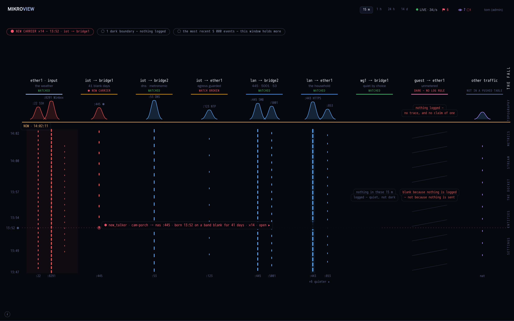

# How to read the fall

The fall is Mikroview's landing page: a live picture of every traffic
boundary your router is watching, drawn as columns of falling marks —
newest at the top, oldest at the bottom.

## What is a "boundary"

Each column (the app calls it a "band") is one boundary: one direction
through one pair of network interfaces that your router's pushed rules
actually mention — for example traffic crossing from your guest network
to the internet. If your router names a group on its rules (say,
"lan"), the fall uses that name instead of the raw interface name.

## The time axis and the NOW edge

Time runs top to bottom. A dashed horizontal line near the top of the
columns, labelled `NOW · <clock time>`, marks the current moment — new
marks appear just below it and everything drifts downward as it ages.
Down the left edge, a column of times (the "rail") tells you how far
back each row is; the exact spacing depends on which span you've chosen
(15 minutes, 1 hour, 24 hours, or 14 days) with the buttons at the top
of the page.

## The header on each column

Every column has a name at the top, and a short line under it stating
what's true right now:

- **WATCHED** (in the "everything's fine" colour) — this boundary is
  logging and nothing unusual is happening.
- **DARK — NO LOG RULE** — your router has rules for this boundary but
  none of them log traffic, so nothing can be shown. This means the
  logging is switched off here, not that the boundary is quiet.
- **COVERAGE UNKNOWN** — no rule has been pushed for this boundary yet,
  so Mikroview can't say either way.
- **✱ <FLAG NAME>** — something on this boundary tripped a flag (see
  "Flagged minutes" below); the flag's name replaces the normal status
  while it's active.
- **NOT IN A PUSHED TABLE** — a catch-all column for traffic that
  doesn't match any boundary your router has told Mikroview about.

A dark or unknown column is drawn as an unbroken black stripe rather
than an empty one — on purpose, so a lack of data never looks the same
as a quiet, healthy boundary.

## The marks in the fall

Below each header sits a small live graph (the "spectrum") and then the
column of falling marks itself.

- **The wavy needle** near the top of a column rises for each active
  carrier — a distinct source or destination port using this boundary
  right now. Taller means busier at this instant.
- **The falling dashes** are the same carriers over time: one vertical
  line per carrier, with a short dash appearing every time traffic
  crossed the boundary in that moment. A taller, more solid dash means
  more traffic in that slice of time; a thin, faint one means barely
  any.
- **Colour tells you what happened to the traffic**: blue for accepted,
  red for dropped or rejected, purple for traffic your router
  translated (NAT), and grey for anything else.
- A soft **glow** down the middle of a column marks the boundary's one
  dominant, steady carrier — the "background hum" of a household device
  that's active for most of the window.
- A **reddish wash** behind the dashes near the top of a column means
  most of this boundary's recent traffic was dropped — the deeper the
  wash extends, the further back that drop-heavy pattern goes; below the
  last real activity the column is simply black.
- If a column logs traffic but genuinely caught none in the current
  span, it says so directly — *"nothing in these 15 m logged — quiet,
  not dark"* — rather than leaving a blank space that could be mistaken
  for the "no log rule" case above.

## The rail labels at top and bottom

A small label sits above each needle's peak, and another sits under the
floor of each column: both name the port (and its common name, if
Mikroview recognises it — e.g. `:443 https`) or say `no port` when there
isn't one. When more carriers are active on a boundary than fit
legibly, the quietest of them fold into a single **"+n quieter ▸"**
label beneath the port names — click or activate it to see all of them
in the Stream view.

## Flagged minutes

When something Mikroview's detectors raised a flag about happened on a
boundary, that exact moment gets a small ring mark beside the fall with
the flag's name and time next to it (for example `◉ new_device ·
14:07`), and a dotted line — a "flag horizon" — runs sideways through
every column at that same height, with the time printed on the rail.
Several flags of the same kind within a couple of minutes of each other
combine into one mark with a `×n` count, so a burst of related flags
never turns into a wall of overlapping rings.

## The window caption at the foot

At the bottom of the page, beside the small **(i)** link (which is what
brought you here), a caption may appear when the fall couldn't fit
everything: *"the most recent 5,000 events — this window holds more"*.
That's a statement, not a control — it tells you the fall is showing
its most recent slice rather than the network's entire history; use the
span buttons at the top if you want a different slice.
